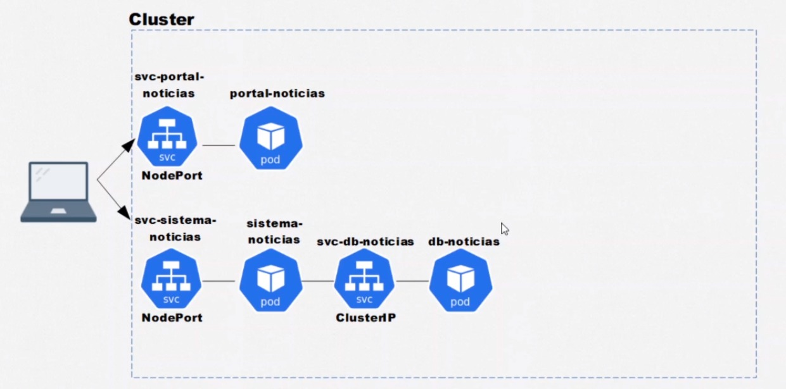

# KUBERNETES: PODS, SERVICES E CONFIGMAPS



## Aquitetura:
---

- Escalabilidade Vertical: _Quando adicionamos mais poder computacional a uma máquina para suportar mais containers e resolver nosso problema._

- Escalabilidade Horizontal: _Quando adicionamos mais máquinas que comunicam entre si (cluster), para suportar mais containers e resolver nosso problema._

---
### Componentes da camada de gerenciamento:
---

Master (control plane) 

- Gerenciar o cluster
- Manter e atualizar o estado desejado 
- Receber e executar novos comandos

kube-apiserver:

- O servidor de API do Kubernetes valida e configura dados para os objetos da API, que incluem pods, serviços, controladores de replicação e outros. O servidor API atende às operações REST e fornece o front-end para o estado compartilhado do cluster por meio do qual todos os outros componentes interagem.

- A principal implementação de um servidor de API do Kubernetes é kube-apiserver. O kube-apiserver foi projetado para ser escalonado horizontalmente — ou seja, ele pode ser escalado com a implantação de mais instâncias. Você pode executar várias instâncias do kube-apiserver e balancear (balanceamento de carga, etc) o tráfego entre essas instâncias.

etcd:

- Armazenamento do tipo Chave-Valor consistente e em alta-disponibilidade usado como repositório de apoio do Kubernetes para todos os dados do cluster.

kube-scheduler:
 
- Componente da camada de gerenciamento que observa os pods recém-criados sem nenhum nó atribuído, e seleciona um nó para executá-los.

- Os fatores levados em consideração para as decisões de agendamento incluem: requisitos de recursos individuais e coletivos, hardware/software/política de restrições, especificações de afinidade e antiafinidade, localidade de dados, interferência entre cargas de trabalho, e prazos.

kube-controller-manager:

- Controlador de nó: responsável por perceber e responder quando os nós caem.
- Controlador de Job: Observa os objetos Job que representam tarefas únicas e, em seguida, cria pods para executar essas tarefas até a conclusão.
- Controlador de endpoints: preenche o objeto Endpoints (ou seja, junta os Serviços e os pods).
- Controladores de conta de serviço e de token: crie contas padrão e tokens de acesso de API para novos namespaces.

cloud-controller-manager:

- Um componente da camada de gerenciamento do Kubernetes que incorpora a lógica de controle específica da nuvem. O gerenciador de controle de nuvem permite que você vincule seu cluster na API do seu provedor de nuvem, e separar os componentes que interagem com essa plataforma de nuvem a partir de componentes que apenas interagem com seu cluster.

Os seguintes controladores podem ter dependências de provedor de nuvem:

- Controlador de nó: para verificar junto ao provedor de nuvem para determinar se um nó foi excluído da nuvem após parar de responder.
- Controlador de rota: para configurar rotas na infraestrutura de nuvem subjacente.
- Controlador de serviço: Para criar, atualizar e excluir balanceadores de carga do provedor de nuvem.

---
### Node Components:
---

Node (nodes) 

- Executar as aplicações

kubelet:

- Um agente que é executado em cada node no cluster. Ele garante que os contêineres estejam sendo executados em um Pod.

kube-proxy:

- É um proxy de rede executado em cada nó no seu cluster.
- Mantém regras de rede nos nós. Estas regras de rede permitem a comuicação de rede com seus pods a partir de sessões de rede dentro ou fora de seu _cluster_.

Container runtime:

- O agente de excecução (runtime) do contêiner é o software responsável por executar os contêiners.
- Kubernetes suporta diversos agentes de execução, como: Docker, containerd, CRI-O.

---
### Pods

- Containers está para docker, assim como pod está para kubernetes.
- É um conjunto de um ou mais containers com um diferente número de porta.
- Cada pod possui um ip aleatório, e não é possível garantir que um pod possua o mesmo ip quando for substituido por um novo.
- Um pod só é finalizado quando todos seus containers forem finalizados ou falharem, então outro pod será criado no lugar dele.
- É possível fazer com que os pods se comuniquem, sendo eles do mesmo ou de um cluster diferente.

---
### CRIANDO POD DE FORMA IMPERATIVA
---

Cria um pod com imagem do nginx:
```bash
$ kubectl run ngnix-pod --image=nginx:latest
```

```bash
$ kubectl get pods
$ kubectl get pods --watch
```
- Lista pods criados
- Watch permite acompanhar o pod em tempo de execução

Exibe diversas informações sobre o pod:
```bash	
$ kubectl describe pod nginx-pod
```

Edita um pod expecífico:
```bash
$ kubectl edit pod nginx-pod
```

Deletando pod:
```bash
$ kubectl delete pod nginx-pod
```
---
### CRIANDO POD DE FORMA DECLARATIVA
---
Em um arquivo .yaml ou .json:

```yaml
apiVersion: v1
kind: Pod
metadata:
  name: primeiro-pod-declarativo
spec:
  containers:
	  - name: nginx-container
	  image: nginx:latest
```

Entregando o arquivo de configuração para api criar o pod:
```bash
$ kubectl apply -f .\primeiro-pod.yaml
```

Deletando pod:
```bash
$ kubectl delete -f .\primeiro-pod.yaml
```
---
### TRABALHANDO COM SERVICES(SVC)
---

Dado a problemática de que não é garantido termos o mesmo ip caso um pod seja substituido, é utilizado um serviço ou DNS que faz a atribuição ao pod correto.

- Abstrações para expor aplicações executando em um ou mais pods
- Proveem IP's fixos para comunição
- Proveem um DNS para um ou mais pods
- São capazes de fazer balanceamento de carga

---
#### ClusterIP: 
  - Fazer a comunição entre diferentes pods dentro de um mesmo cluster apartir de um serviço.

Pod:
```yaml
apiVersion: v1
kind: Pod
metadata:
  name: pod-1
  labels:
    app: primeiro-pod
spec:
  containers:
	  - name: container-pod-1
	    image: nginx:latest
      ports:
        - containerPort: 80
```

- Lebels são pares de chave/valor atrelhados a um objeto. É utilizado para especificar ou identificar objetos. No exemplo acima, utilizamos para rotular o Pod (app: primeiro-pod).

Service:
```yaml
apiVersion: v1
kind: Service
metada:
  name: svc-pod-1
  selectors:
    app: primeiro-pod
spec:
  type: ClusterIP
  selector:
    app: primeir-pod
  ports:
    - port: 80
      targetPort: 9000
```

- Para definirmos a qual Pod um determinado serviço pertence - ou seja, realizar o bind entre service - pod devemos utilizar o selector informando sua label. Lembrando que um service pode atender mais que apenas um objeto.

- Realizamos duas configurações de porta em nosso serviço, a 80 que é porta que do Pod e 9000 que é porta do serviço.

---
#### NodePort: 
  - Abre comunicação para o mundo externo.

```yaml
apiVersion: v1
kind: Service
metadada:
  name: svc-pod-1
spec:
  type: NodePort
  selector:
    app: primeiro-pod
  ports:
    - port: 80
      nodePort: 30000
```

- Na configuração de portas, a porta 80 se refere ao serviço interno e 30000 para o serviço externo.

- Para acessar o Pod externamente, basta informar o IP do serviço + porta externa. Caso esteja utilizando o sistema operacional Windows localhost já é mapeado, sendo necessário apenas informar a porta de acesso.

- Caso esteja utilizando Linux, muda um pouco a forma de acesso, pois o IP que será utilizado é fornecido pela máquina virtual (no caso o minikube). Com isso, devemos rodar o seguinte comando para conseguir o IP do node de acesso:

```bash
kubectl get nodes -o wide
```

---
#### LoadBalancer:
  - Abre comunicação para o mundo externo usando o Load Balancer do provedor.
  - Utilizam automaticamente os balanceadores de carga de cloud providers.
  - Por serem um Load Balancer também são um NodePort e ClusterIP ao mesmo tempo.
  
```yaml
apiVersion: v1
kind: Service
metadata:
  name: svc-pod-1-loadbalancer
spec:
  type: LoadBalancer
  ports:
    - port: 80
      nodePort: 30000
  selector:
    app: primeiro-pod
```
---
#### ConfigMap:
- Arquivo responsável por armazenar configurações do nosso objeto. Tornando-o mais dinâmico, no sentido de ser mais portável, seguindo a boa prática de desacoplamento.

```yaml
apiVersion: v1
kind: ConfigMap
metadata:
  name: db-configmap
data:
  MYSQL_DATABASE: noticias
  MYSQL_PASSWORD: root
  MYSQL_ROOT_PASSWORD: root
```
Para utilizarmos a configuração, existe duas maneiras de passarmos no spec do pod:

* Primeira, informando váriavel por variável:
```yaml
# spec: ...
env:
  - name: MYSQL_DATABASE
    valueFrom:
      configMapKeyRef:
        name: db-configmap
        key: MYSQL_ROOT_PASSWORD
```
* Segunda, passando toda configuração:
```yaml
# spec: ...
envFrom:
  - configMapRef:
      name: db-configmap
```

Comando que exibe ConfigMap em execução:
```yaml
$ kubectl get configmap
```

---
### COMANDOS DE SUPORTE
--- 
Acessar bash do pod:
```bash
$ kubectl exec -it portal-noticias -- bash
```

Exibe diversas informações sobre o pod:
```bash	
$ kubectl describe pod portal-noticias
```

Exibe pods em execução com alguns detalhes como ip:
```bash	
$ kubectl get pods -o wide
```
```bash	
$ kubectl get svc -o wide
```
```bash	
$ kubectl get configmap -o wide
```

### References:

- [Componentes do Kubernetes](https://kubernetes.io/pt-br/docs/concepts/overview/components/)
- [Kubernetes: Pods, Services e ConfigMaps](https://cursos.alura.com.br/course/kubernetes-pods-services-configmap)
- [Labels and Selectors](https://kubernetes.io/docs/concepts/overview/working-with-objects/labels/)
- [Type NodePort](https://kubernetes.io/docs/concepts/services-networking/service/#nodeport)


